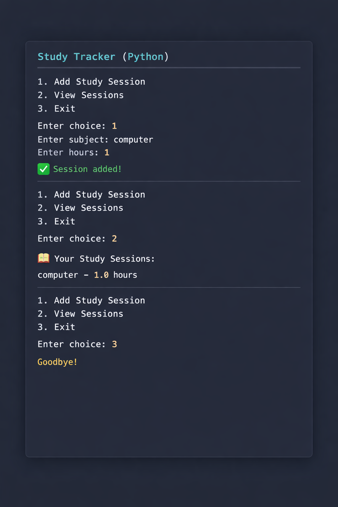

# 📚 Study Tracker (Python)


A simple beginner-friendly Study Tracker built using Python.
This app helps you record and view your daily study sessions.

---

## 🚀 Features

* Add study sessions
* View all sessions
* Data saved using JSON
* Easy to use (runs in terminal)

---

## 🛠️ Tech Used

* Python
* JSON (for data storage)

---

## ▶️ How to Run

1. Install Python
2. Download or clone this repository
3. Run the program:

```
python main.py
```

---

## 📸 Example Output



---

## 💡 Future Improvements

* Add daily goals 🎯
* Add streak system 🔥
* Build GUI using Tkinter
* Add charts 📊

---

## 🙌 Author

Parth Rawat
